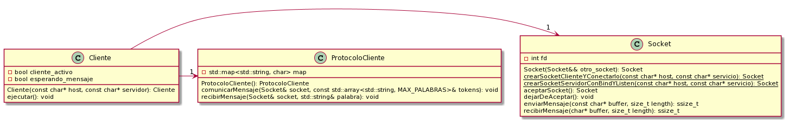
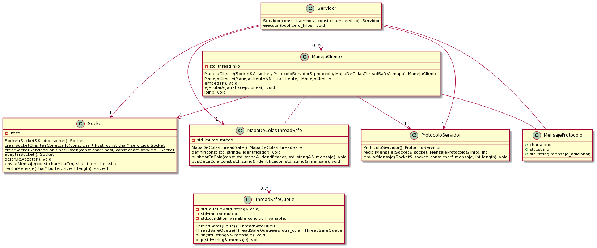
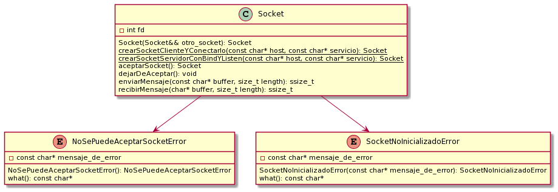
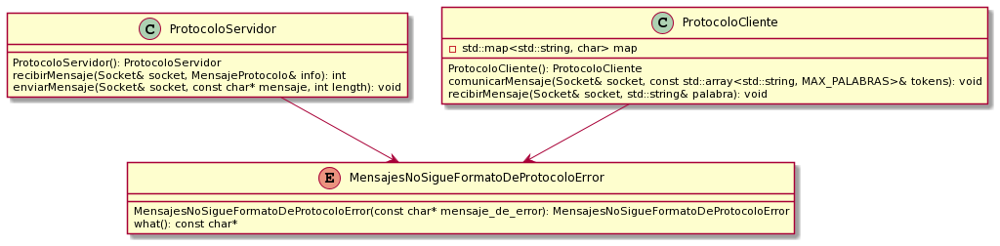

# Taller de Programación I #

# Código: 75.42

##  Trabajo Práctico 3 (tres)
<h5>Segundo Cuatrimestre 2021 </h5> 

## Docentes:
- Andrés Veiga
- Martín Di Paola
- Ezequiel Werner
- Federico Gomez Peter
- Francisco Vazquez
- Leonardo Giampieri
- Leo Bellaera

## Alumno:
Andrés Zambrano-Padrón: 105500

## Breve descripción del trabajo:
El presente trabajo tiene la finalidad de desarrollar un Message Oriented Middleware (MOM) elemental, siendo este la base de los MOM que usan los sistemas distrubuidos a mayor escala. En este, se puede tener un servidor que acepta y se comunica con varios clientes a la vez, pudiendo cada uno de estos clientes definir sus colas a usar, pushear a estas y sacar información cuando lo deseen. Dicho programa sirve entonces como un medio de comunicación entre varios clientes, a través de los comandos provistos. 

Al tener la posibilidad de atender a varios clientes al mismo tiempo, cada uno pudiendo o no actuar en las mismas colas, puede haber espacio para errores multi-hilos. Sin embargo, este programa utiliza colas thread-safe que imposibilitan la aparición de dichos errores.

Para realizar el trabajo, primero se comenzó con implementar un cliente andante y un servidor que recibía información del cliente (y enviaba mensajes al cliente si correspondía) mediante una clase intermediaria para no hacer uso de sockets. Esto se hizo así para dejar afuera la posible complejidad que trae el uso de sockets, y poder testear que la comunicación entre el cliente y el servidor era óptima. Dicho intermediario cumplía con la interfaz que tiene una clase socket para enviar y recibir mensajes, para que después añadir la funcionalidad de los sockets no fuera complicado.

Una vez concluído los testings, se procedió ahora si a añadir los sockets, pudiendo así el servidor recibir de a un cliente a la vez, y poder comunicarse con dicho cliente de forma correspondiente. Se terminó de emprolijar la lógica del servidor, haciendo refactorizaciones de código.

Teniendo ahora sí la certeza de que la comunicación cliente-servidor era acorde, se procedió a implementar un servidor multi-hilos que pudiera aceptar a varios clientes a la vez. Para esto, se creó una clase ManejaClientes que actúa como un objeto thread. Dicha clase ahora encapsula el socket del cliente y al ser convocado pasa a ser el hilo que atiende al cliente asignado. Como la lógica para atender a un cliente ya existía, y además estaba factorizada, fue sencillo ver qué era lo que tenía que hacer cada hilo con su cliente. 

Además de los hilos que atienden a los clientes, se implementó un hilo aceptador, que es convocado desde el hilo main. Dicho hilo aceptador se encarga justamente de aceptar conexiones entrantes, usando el socket aceptador del servidor para hacer esto. Dentro del hilo, cada nuevo cliente es creado y agregado a la lista de clientes, para después convocar el hilo que controla la comunicación con el nuevo cliente. El hilo aceptador se bloquea en el accept() del socket servidor; si hay un error, o se 'apagó' el socket servidor, se lanza una excepción. Dicho hilo accept recibe la excepción, entiende que no hay más clientes que aceptar, y se cierran todos los hilos del cliente convocados para así volverse a unir al hilo main.

El hilo main es el que se encarga de cerrar el socket servidor, para así hacer que el hilo aceptador deje de esperar nuevos clientes. Esto sucede cuando el usuario escribe por entrada estándar una 'q' (quit). Cuando esto sucede, se deja de aceptar nuevos clientes, pero continua la comunicación con los otros clientes hasta que cada uno de estos decidan terminar su respectiva ejecución. Se unen así todos los hilos terminando con la ejecución del programa en su totalidad.

Un comentario significativo es que se agregó la funcionalidad en la función ejecutar del servidor, de poder decidir si se quiere una ejecución con solo el hilo main, o si se quiere la ejecución multi-hilos normal. Dicha adición ayuda a debuggear el programa más fácilmente cuando no se necesitan la presencia de hilos. Se tiene como base que si se ejecuta el servidor solo con el hilo main, se aceptan de forma secuencial solo 10 clientes.

Por último, pero no menos importante, se discute el hecho de que el programa es thread-safe, es decir, que efectivamente aguanta la comunicación entre varios clientes a la vez, dejando los recursos usados por los hilos clientes en estados válidos. Para almacenar las colas, se utiliza un mapa de colas thread-safe. Se escogió un mapa para poder hacer uso del identificador de una cola y tener acceso rápido a dicha cola que se quiere modificar o crear.

Dicho mapa de colas necesita aguantar llamadas de varios clientes a la vez, y que el mapa no quede en un estado inválido. Para esto se utiliza un mutex, que cuando se hace un lock sobre este, impide a otros hilos realizar un lock sobre el mismo mutex, dejando entonces al mapa que hizo lock hacer las operaciones correspondientes. Es necesario que el mapa de colas sea realice esto, ya que existe la posibilidad de que, por ejemplo, un cliente A quiera definir una cola UnaCola que hasta ese momento no existe. Al encontrarse entonces en el método de definir, se pregunta si existe una cola con el nombre UnaCola. Como no existe, se procede a crearla. Sin embargo, en ese momento puede ser que haya un cambio de contexto en el que un cliente B añade la cola UnaCola. Al volver al cliente A, se va a añadir otra UnaCola ya que siguiendo el hilo de ejecución de antes del cambio de contexto, no existía otra cola con nombre UnaCola. Este es uno de los muchos errores que puede surgir con un mapa que no es thread-safe. Para solucionarlo entonces, al entrar en el método de definir una cola, el cliente A hace un lock sobre el mutex. A partir de ahí se puede considerar de que va a realizar una operación atómica, pero en realidad va a ser varias operaciones para nada atómicas. ¿Por qué es esto? Porque si sucede el mismo cambio de contexto que antes, y el cliente B intenta definir la cola UnaCola, primero va a intentar hacer un lock sobre el mutex, pero como el mutex lo tiene ocupado el cliente A, no va a poder tomar control y se fuerza un cambio de contexto. Entonces, cuando el hilo del cliente A se vuelva a ejecutar, el mapa va a estar tal como lo vio por primera vez, es decir, sin ninguna cola con nombre UnaCola. Todos felices.

Esto es para el método definir una cola del mapa de colas. Para los métodos de pushear y hacer pop a una cola con identificador UnaCola, se utiliza el mismo concepto. Primero se toma el control haciendo un lock sobre el mutex, se pregunta si existe UnaCola en el primer lugar. Si existe, se cierra el lock y se hace la operación sobre la cola. Si no existe, también se cierra el lock y se retorna. Estos locks sirven para evitar que, en caso de que no exista UnaCola, un cambio de contexto no la termine agregando de la nada. 

Es importante que, una vez se sabe que la cola UnaCola existe, se cierre el lock y se opere directamente sobre UnaCola. Esto con el objetivo de evitar una contención excesiva del recurso: como se verificó que el mapa de colas es válido y que la cola existe, no hace falta seguir teniendo el lock cuando se opera directamente sobre la cola UnaCola.

Ahora bien, el mapa de colas no es un mapa de colas común, es un mapa de colas thread-safe. Si con el mapa uno se tenía que preocupar por clientes accediendo y modificando el mapa de colas, ahora la preocupación está en clientes que acceden a la misma cola. Cuando se trabaja con hilos hay que imaginarse todos los escenarios posibles. Normalmente, implementar el push y pop de una cola thread-safe es bastante directo. Se realiza un lock sobre el mutex que tiene la cola, se añade o se saca un elemento de la cola, como corresponda, y se libera el lock. 

Sin embargo, hay una funcionalidad que tiene el programa, que es que un cliente A puede hacer un pop de la cola UnaCola, y si UnaCola está vacía, se espera hasta que un cliente B añada un elemento a UnaCola. Para hacer esto, se hace uso de una *condition variable* en la clase. Cuando se convoca el método pop, se hace un lock único sobre el mutex. Se revisa entonces si la cola está vacía o no. Si no está vacía, se saca el elemento como siempre. Si está vacía, se entra en un loop del que el hilo no saldrá hasta que se detecte que la cola no está vacía. Pero, si se hizo un lock sobre el mutex, ¿cómo otro hilo va a poder añadir un elemento a la cola? Como se hizo un lock único, este puede ser enviado como parámetro a la variable de condición, para forzar un cambio de hilo, y dejar de tener lockeado el mutex. Cuando se produzca el cambio de contexto de vuelta al hilo, el lock se vuelve a activar, así que cualquier operación siguiente puede ser vista como una atómica. Para que esto funcione de forma óptima, si el cliente A está esperando a que añadan un elemento a la cola, y va el hilo del cliente B y añade un elemento a dicha cola, se tiene que notificar a la variable de condición respectiva, para forzar un cambio de contexto al hilo del cliente A y poder hacer el pop correspondiente.

## Diagramas de clase

Se procede entonces a mostrar los diagramas de clase.

Diagrama del cliente:

Diagrama del servidor:

Diagrama de excepciones de la clase Socket:

Diagrama de excepciones de las clases de protocolo de comunicación:

